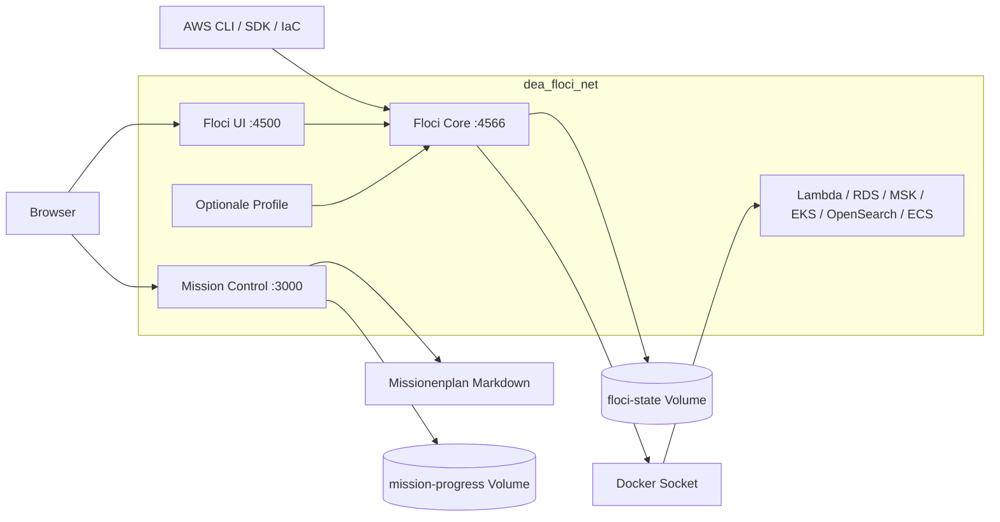

# Plattformarchitektur

## Endpoints

- Hostzugriff auf Floci: `http://localhost:4566`
- Containerzugriff auf Floci: `http://floci:4566`
- Missionsübersicht: `http://localhost:3000`
- Floci-Ressourcen-UI: `http://localhost:4500`

Alle statischen Webports sind an `127.0.0.1` gebunden. Das explizite Bridge-Netz `dea_floci_net` wird über `FLOCI_SERVICES_DOCKER_NETWORK` auch an dynamische Floci-Container weitergegeben.

Floci erhält den Docker-Socket ausschließlich, weil reale Lambda-, RDS-, MSK-, ECS-, EKS- und OpenSearch-Data-Planes Container erzeugen. Die Toolbox erhält ihn nur im expliziten Profil `tools`. Dieser Zugriff ist host-privilegiert und für Produktionsumgebungen ungeeignet.
