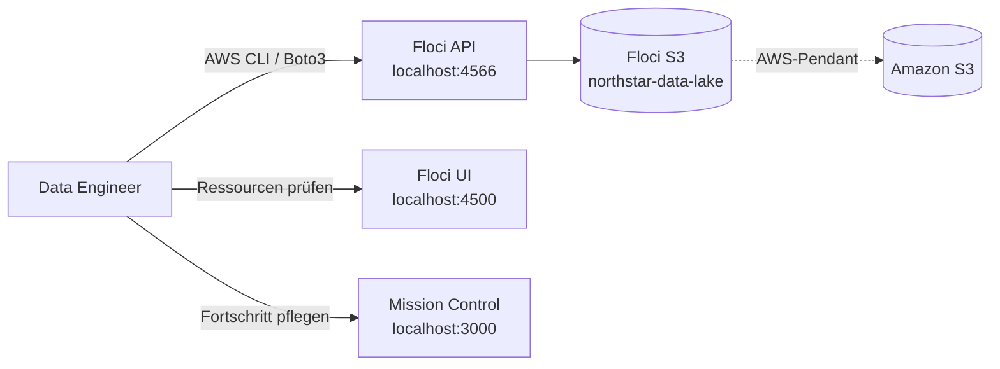
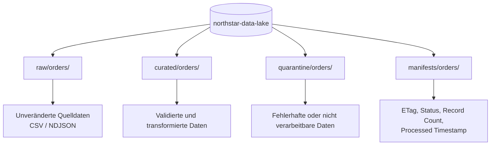
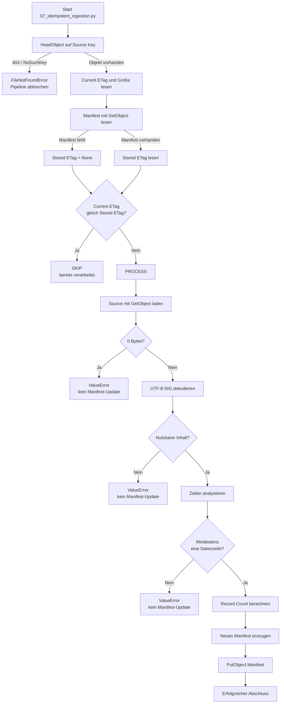
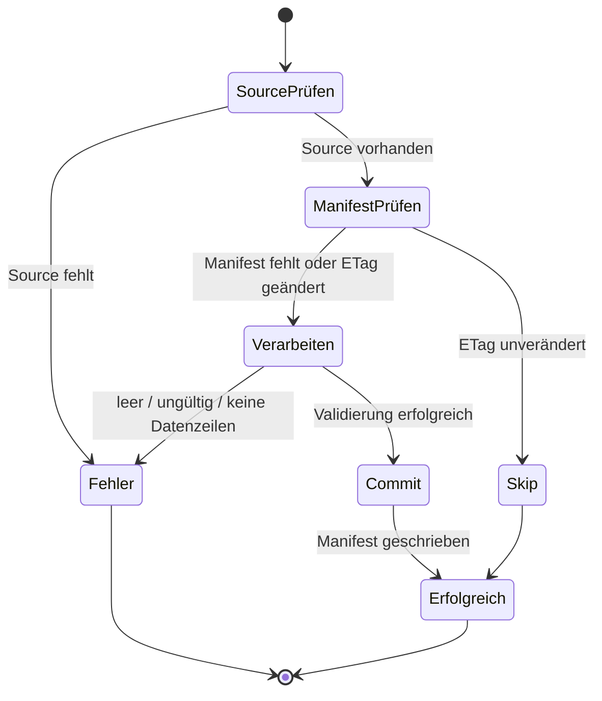

# M01 – Architekturdiagramm: S3 Data Lake Fundamentals

## 1. Zweck

Dieses Dokument beschreibt die in Mission M01 aufgebaute lokale Data-Lake-Architektur mit **Floci S3** als AWS-kompatibler Emulationsumgebung und **Amazon S3** als produktivem AWS-Pendant.

Die Architektur demonstriert:

- strukturierte Ablage über Object Keys und Prefixe,
- Trennung von Raw-, Curated-, Quarantine- und Manifest-Zonen,
- Metadatenprüfung mit `HeadObject`,
- Inhaltszugriff mit `GetObject`,
- ETag-basierte Idempotenz,
- Validierung vor dem Commit,
- Manifest-Aktualisierung erst nach erfolgreicher Verarbeitung.

---

## 2. Systemkontext



### Komponenten

| Komponente | Funktion |
|---|---|
| Data Engineer | Führt CLI- und Python-Skripte aus und untersucht das Verhalten der Pipeline. |
| Floci API | Stellt lokal AWS-kompatible S3-APIs bereit. |
| Floci UI | Zeigt Buckets, Objekte, Keys und Metadaten. |
| Mission Control | Dokumentiert den Lernfortschritt der Mission. |
| Floci S3 | Lokales Data Plane für Bucket-, Object- und Manifest-Operationen. |
| Amazon S3 | Produktives AWS-Pendant der lokal emulierten Architektur. |

---

## 3. Data-Lake-Zonen



### Zonenbedeutung

| Zone | Zweck |
|---|---|
| `raw/` | Unveränderte Quelldaten aufbewahren. |
| `curated/` | Später validierte und analytisch nutzbare Daten speichern. |
| `quarantine/` | Fehlerhafte Dateien oder Datensätze isolieren. |
| `manifests/` | Technischen Verarbeitungszustand persistent speichern. |

In M01 wird die Raw- und Manifest-Logik praktisch umgesetzt. Curated und Quarantine sind als Zielstruktur geplant und werden in späteren Missionen weiter ausgebaut.

---

## 4. Verwendete Object Keys

### Quelldatei

```text
s3://northstar-data-lake/raw/orders/ingestion_date=2026-07-19/orders_20260719T094506Z.csv
```

### Manifest

```text
s3://northstar-data-lake/manifests/orders/orders_20260719T094506Z.json
```

### Namensschema

```text
<zone>/<dataset>/ingestion_date=YYYY-MM-DD/<dataset>_<UTC timestamp>.<extension>
```

Die verbindlichen Regeln sind zusätzlich in `docs/s3-naming-convention.md` dokumentiert.

---

## 5. Idempotente Ingestion-Pipeline



---

## 6. Commit-after-success

Das Manifest repräsentiert ausschließlich den letzten **erfolgreich verarbeiteten** Zustand.

```text
Validierung erfolgreich
→ Manifest aktualisieren

Validierung fehlgeschlagen
→ Exception
→ Manifest unverändert lassen
```

Dieses Muster verhindert, dass eine technisch vorhandene, aber fachlich ungültige Datei als erfolgreich verarbeitet markiert wird.

---

## 7. Zustandsmodell



---

## 8. Failure-Injection-Szenarien

| Szenario | Erwartetes Verhalten | Manifest-Update |
|---|---|---|
| Falscher Source Key | `HeadObject` liefert 404, danach `FileNotFoundError` | Nein |
| 0-Byte-Datei | `ValueError: Source object is empty` | Nein |
| Nur Header, keine Datenzeile | Validierung schlägt fehl | Nein |
| Gleicher Key mit verändertem Inhalt | neuer ETag, Entscheidung `PROCESS` | Ja, nach Erfolg |
| Unveränderte Datei | gleicher ETag, Entscheidung `SKIP` | Nein |
| UTF-8-BOM | Dekodierung mit `utf-8-sig` | Ja, sofern sonst valide |
| 0-Byte Folder Marker | Als technisches Objekt erkennen, nicht als Datendatei behandeln | Nein |

---

## 9. AWS-API-Zuordnung

| Operation | Zweck in M01 | AWS-Pendant |
|---|---|---|
| `CreateBucket` | Data-Lake-Bucket anlegen | Amazon S3 |
| `PutObject` | CSV, NDJSON und Manifest hochladen | Amazon S3 |
| `ListObjectsV2` | Objekte nach Prefix untersuchen | Amazon S3 |
| `HeadObject` | ETag, Größe und Metadaten lesen | Amazon S3 |
| `GetObject` | Datei- und Manifest-Inhalt lesen | Amazon S3 |

---

## 10. Architekturentscheidungen

### ETag als lokaler Änderungsindikator

Für M01 wird der ETag verwendet, um geänderte Inhalte zu erkennen.

```text
Current ETag == Stored ETag
→ SKIP

Current ETag != Stored ETag
→ PROCESS
```

In echtem Amazon S3 ist ein ETag nicht in allen Fällen eine einfache MD5-Prüfsumme, insbesondere bei Multipart-Uploads oder bestimmten Verschlüsselungsverfahren. In produktiven Systemen können deshalb zusätzlich verwendet werden:

- S3 Checksum-Felder,
- Version IDs,
- fachliche Idempotency Keys,
- Datenbankbasierte Processing Ledgers.

### Manifest statt implizitem Zustand

Das Manifest macht den Verarbeitungszustand explizit und überprüfbar. Dadurch kann die Pipeline nach Wiederholungen, Abstürzen oder mehrfach zugestellten Events deterministisch entscheiden.

### Prefixe statt Verzeichnisse

S3 besitzt einen flachen Namespace. Raw, Curated und Quarantine sind keine echten Verzeichnisse, sondern logische Zonen, die über gemeinsame Präfixe in den Object Keys entstehen.

---

## 11. AWS-DEA-C01-Transfer

Die Architektur trainiert insbesondere folgende prüfungsrelevante Entscheidungen:

- `HeadObject` für Metadaten statt vollständigem Download,
- `GetObject` für tatsächliche Datenverarbeitung,
- S3 als skalierbare Data-Lake-Speicherschicht,
- Prefix-basierte Datenorganisation,
- idempotente Verarbeitung,
- Checkpoint- beziehungsweise Manifest-Update nur nach Erfolg,
- Trennung zwischen technischem Vorhandensein und fachlicher Datenqualität,
- gezielte Fehlerbehandlung statt pauschalem Verschlucken von `ClientError`.

---

## 12. Aktueller Implementierungsstand

```text
Lokale Quelle
    ↓ Upload
Floci S3 Raw Zone
    ↓ HeadObject
ETag-Vergleich mit Manifest
    ├── unverändert → SKIP
    └── neu/geändert → GetObject und Validierung
                              ↓ Erfolg
                       Manifest aktualisieren
```

### Zugehörige Artefakte

```text
missions/M01-s3-data-lake/
├── data/
├── docs/
│   ├── architecture.md
│   └── s3-naming-convention.md
├── manifests/
├── scripts/
│   └── 07_idempotent_ingestion.py
└── README.md
```

---

## 13. Abgrenzung zu späteren Missionen

M01 beweist die S3-Grundlagen und die idempotente Ingestion-Entscheidung. Noch nicht Bestandteil dieser Architektur sind:

- CSV-zu-Parquet-Transformation,
- Glue Data Catalog,
- Athena-Abfragen,
- S3 Lifecycle und Versioning,
- Event-getriggerte Lambda-Verarbeitung,
- produktive IAM- und KMS-Konfiguration,
- Data-Quality-Regelwerke auf Datensatzebene.

Diese Themen werden in späteren Missionen ergänzt.
